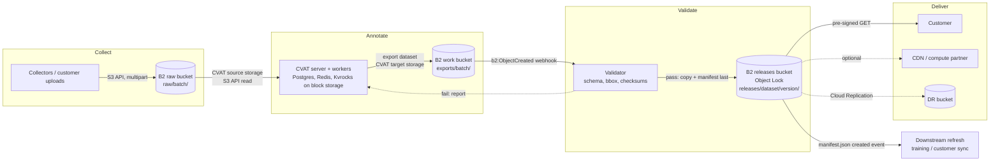
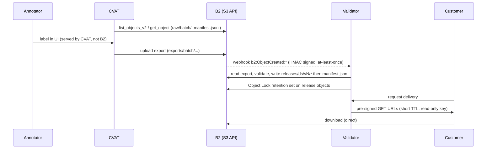

# CVAT annotation pipeline on Backblaze B2

Evidence reviewed: 2026-09-29. CVAT source `develop` @ `0a0056414` (reports `2.49.1-alpha`), docs.cvat.ai, B2 documentation, B2 CLI shapes, and emulator-backed application tests. See [Evidence and validation scope](#evidence-and-validation-scope).

## Workload

An AI data provider collects raw images, has annotators label them in [CVAT](https://github.com/cvat-ai/cvat),
validates the labels, publishes immutable versioned datasets and delivers them to customers, then repeats as new data arrives.
B2 holds the durable objects: raw media, CVAT exports, released dataset versions. CVAT keeps its own state (Postgres, Redis, Kvrocks, ClickHouse) on block storage.

## Data flow

## B2 zones

| Zone | Bucket | Prefix | Versioning / lifecycle | Lock | Purpose |
|---|---|---|---|---|---|
| Raw | `<org>-cvat-raw` | `raw/<batch>/` | keep versions; purge non-current after N days ([example](../../examples/lifecycle-raw.json)) | no | Immutable-by-convention source media + CVAT `manifest.jsonl` |
| Work | `<org>-cvat-work` | `exports/<batch>/` | purge non-current after N days ([example](../../examples/lifecycle-work.json)) | no | CVAT dataset exports, validation reports |
| Releases | `<org>-cvat-releases` | `releases/<dataset>/<version>/` | none: nothing expires | governance default ([example](../../examples/object-lock.json)) | Customer-facing immutable versions |
| DR (optional) | `<org>-cvat-releases-dr` | same | mirrors | Object Lock must match source | Replication target |

Separate buckets because Object Lock, lifecycle, replication, encryption and event rules are bucket-level, while a key can only carry one prefix. Bucket names are globally unique; pick an org-specific prefix and expect 403/404 collisions. Full key layout: [object-layout.md](object-layout.md).

## Boundaries

| Concern | Lives in | Why |
|---|---|---|
| Media, exports, released datasets, manifests | B2 | Durable, large, read by many consumers, free-egress friendly |
| CVAT metadata (tasks, jobs, users, annotation state) | Postgres (`cvat_db`) on block storage | Transactional; B2 is object storage |
| Queues, caches (`cvat_redis_inmem`, `cvat_redis_ondisk` Kvrocks), ClickHouse analytics | Local volumes | Low latency, random writes |
| Annotation UI image serving | CVAT server/workers (chunks prepared by CVAT) | Interactive latency; do not point browsers at B2 |
| Compute (validator, refresh) | Your compute or a B2 compute partner | B2 stores, does not compute |
| Delivery | B2 pre-signed URLs; optional CDN | See [decisions](decisions.md) ADR-5 |

## B2 capability map

Marked = used by this architecture. Unmarked = deliberately not used.

| Capability | Used | Where |
|---|---|---|
| S3-compatible API | [x] | CVAT (boto3, `endpoint_url`), validator, sample app |
| Pre-signed URLs | [x] | Customer delivery, optional browser upload |
| CORS | [x] optional | Customer portal origin ([example](../../examples/cors.json)) |
| Multipart upload | [x] | Large exports/media via boto3 transfer; sample `--multipart-mb` |
| Scoped application keys | [x] | One key per role, bucket + prefix + capabilities |
| Event notifications | [x] | Export created -> validate; manifest created -> refresh ([example](../../examples/event-notifications.json)) |
| Versions | [x] | Raw and work buckets |
| Lifecycle rules | [x] | Raw, work (B2 semantics: hide, then delete) |
| SSE-B2 | [x] | Default encryption on all buckets ([example](../../examples/sse.json)) |
| SSE-C | [ ] | Not needed; key custody burden |
| Object Lock | [x] | Releases bucket |
| Legal hold | [ ] | Add per contract if needed |
| Cloud Replication | [x] optional | Releases -> DR bucket ([example](../../examples/replication.json)); bucket-to-bucket, not customer delivery |
| Included egress | [x] | Customer downloads; check [pricing/terms](https://www.backblaze.com/cloud-storage/pricing) for limits |
| CDN delivery | [x] optional | Hot public-facing deliveries via partner CDN |
| Compute-partner delivery | [x] optional | Pre-annotation/training next to data |
| Standard B2 | [x] | Default for all zones |
| B2 Overdrive | [ ] conditional | See below |
| Local cache | [ ] conditional | See below |

### Standard B2 vs Overdrive vs local cache

- Standard B2: default. Annotation is human-paced; ingest, export and delivery are throughput-tolerant.
- [B2 Overdrive](https://www.backblaze.com/cloud-storage/b2-overdrive): consider when the same released datasets feed sustained multi-GPU training or large parallel refresh jobs where object-store throughput is the bottleneck. Pricing and minimums are on the Overdrive page; it is sales-engaged, so it is not part of this sample.
- Local cache (NVMe next to compute): consider when validators or training re-read the same dataset version many times. Safe because released versions are immutable and keyed by version.
- Neither helps annotator UI latency; that path is CVAT's own chunk cache.

## CVAT connection (verified against CVAT docs and source)

CVAT has a Backblaze B2 section in its docs: choose provider **Amazon S3** and set **Endpoint URL** to `https://s3.<region>.backblazeb2.com`.

| CVAT field | Value |
|---|---|
| Provider | Amazon S3 (API value `AWS_S3_BUCKET`) |
| Bucket name | B2 bucket |
| Authentication type | Key ID and secret access key pair (B2 `keyID` / `applicationKey`) |
| Endpoint URL | Derived from your bucket's region; required for B2 |
| Region | Optional |
| Prefix | Optional; scope CVAT to `raw/<batch>/` or `exports/` |
| Manifests | Optional `manifest.jsonl`; required only for CVAT features that need a manifest (see CVAT docs) |

Source check: `S3CloudStorage` builds a boto3 `Session.resource("s3", endpoint_url=...)` and uses `head_bucket`, `head_object`, `list_objects_v2`, ranged/whole `get_object` downloads and `upload_fileobj` (`cvat/apps/engine/cloud_provider.py`). `specific_attributes` is a URL query string (`endpoint_url=...&region=...&prefix=...`). Object keys starting with `/` or containing `//` are unusable in CVAT. Automating the attach: [infrastructure/cvat](../../infrastructure/cvat/README.md).

## Security, retention, provenance, access

Key roles (one bucket + one prefix each; commands in [examples](../../examples/README.md)):

| Role | Bucket / prefix | Capabilities |
|---|---|---|
| ingest-writer | raw `raw/` | `listFiles`, `writeFiles` |
| cvat-source-reader | raw `raw/` | `listFiles`, `readFiles` |
| cvat-export-writer | work `exports/` | `listFiles`, `readFiles`, `writeFiles` |
| validator-reader | work `exports/` | `listFiles`, `readFiles` |
| publisher | releases `releases/` | `listFiles`, `readFiles`, `writeFiles`, `writeFileRetentions` |
| delivery-signer | releases `releases/<dataset>/`, expiring | `listFiles`, `readFiles` (URLs cannot write) |
| provisioning (admin/master) | account | Bucket settings, lock, replication, notifications. Master key only where provisioning requires it; not used at runtime |

- Encryption: SSE-B2 default; TLS in transit.
- Retention: releases are write-once via Object Lock (governance by default; compliance is irreversible, choose deliberately). Enabling Object Lock on a bucket cannot be reverted, and it lowers the per-version file-metadata limit, so keep metadata small (the sample stores one `sha256` entry).
- Provenance: every release carries `manifest.json` with per-file SHA-256 and a content fingerprint, written last as a commit marker; each object also stores its `sha256` in metadata. Raw batch and CVAT export prefixes tie a release back to its inputs.
- Access: customers get short-TTL pre-signed URLs; anyone holding a URL can use it until expiry, so treat delivery manifests as secrets.
- Secrets: `.env` files at mode 0600, gitignored; keys never logged.

## Where B2 does not fit

- CVAT's Postgres, Redis, Kvrocks and ClickHouse data: needs block storage and low-latency random I/O.
- Serving images to annotators interactively: latency-sensitive; CVAT prepares and serves its own chunks.
- Anything needing POSIX semantics or in-place edits: B2 objects are immutable; edits create versions.
- Running the validator, model pre-annotation or training: compute lives elsewhere (optionally a compute partner).
- Customer delivery via Cloud Replication: it copies bucket to bucket inside your account; customers need URLs or their own keys.
- Object tagging: B2's S3 API does not fully support it; use key prefixes and metadata.

## Integrations

| Tool | Role | Connection | Evidence |
|---|---|---|---|
| CVAT | Annotation, QA, export | S3 API cloud storage, Endpoint URL | source 2.49.1-alpha (`develop`), docs 2026-09-29 |
| CVAT webhooks | Job/task state changes | HTTP webhook (complements B2 events; CVAT-level, not storage-level) | docs 2026-09-29 |

## Sample application

[applications/cvat-b2-dataset-pipeline](../../applications/cvat-b2-dataset-pipeline/README.md): synthetic images + COCO annotations -> raw/export staging -> validation -> versioned release with checksums (optional Object Lock) -> pre-signed delivery. Collapses the three buckets into one with prefixes for a simple setup.

## Evidence and validation scope

The design uses CVAT fields and S3 calls established by documentation and source review; B2 JSON shapes and event types established by B2 documentation and CLI help; and sample application behavior covered by moto-backed S3 tests.

Deployment validation must cover the chosen CVAT release, real key scoping, bucket Object Lock and lifecycle posture, replication, event delivery and signature handling, presigned URL policy, browser CORS operations, and measured throughput. These are environment-specific acceptance checks rather than properties inferred from the emulator tests.
