# Dataloop DDOE direct-data pipeline on Backblaze B2

Evidence reviewed: 2026-09-29. This design maps Dataloop DDOE's documented generic S3 API integration and direct-data model to the Backblaze B2 S3-compatible endpoint. The documentation presents the connector under DDOE's on-premises provider category, so the target DDOE release must pass the acceptance checks below before production use.

## Workload

An AI data provider keeps source media and documents in B2, synchronizes selected prefixes into Dataloop DDOE, and runs preprocessing, annotation, enrichment, applications, or pipelines on a connected compute cluster. Approved outputs return to B2 and are promoted into immutable, customer-deliverable dataset releases.

B2 remains the durable object and release system of record. DDOE supplies dataset synchronization, workflow state, compute orchestration, derived metadata, and interactive operations.

## Data flow

```mermaid
flowchart LR
  SRC[Collectors / customer uploads] -->|S3 API| RAW[(B2 raw bucket<br/>raw/batch/)]
  RAW -->|generic S3 API integration| STREAM[DDOE storage driver<br/>+ streamer service]
  STREAM --> DATASET[DDOE dataset]
  DATASET --> COMPUTE[Compute cluster<br/>preprocesses / apps / pipelines]
  COMPUTE -->|outputs + reports| WORK[(B2 work bucket<br/>ddoe/project/)]
  WORK -->|validation| VAL[Release validator<br/>schema + quality + checksums]
  VAL -->|files, then manifest last| REL[(B2 releases bucket<br/>Object Lock)]
  REL -->|short-lived presigned GET| CUSTOMER[Customer / training consumer]
```

DDOE documentation describes the direct path as `Dataset → Storage Driver → Streamer Service → S3 API → Object Storage` and states that the example source files remain in object storage rather than being copied into DDOE. Treat previews, caches, generated metadata, annotations, and exports as additional derivatives that still need retention and deletion policy.

## B2 zones

| Zone | Suggested location | DDOE relationship | Policy |
|---|---|---|---|
| Raw | `<org>-ddoe-raw/raw/<batch>/` | Synchronized source dataset | Read-only source where possible; version and lifecycle superseded inputs |
| Platform work | `<org>-ddoe-work/ddoe/<project>/` | Writable previews, generated assets, exports, and reports | Retain for review; expire superseded work under policy |
| Releases | `<org>-ddoe-releases/releases/<dataset>/<version>/` | Written only by the release publisher | Immutable version, Object Lock governance by default |
| DR, optional | `<org>-ddoe-releases-dr/` | No DDOE access | Cloud Replication target with matching retention posture |

Use separate buckets when raw data, platform-generated work, and releases require different Object Lock, lifecycle, notification, or replication settings. If a proof of concept uses prefixes in one bucket, do not assume it exercises the same security controls as the production design.

## Configure the DDOE storage integration

The current DDOE S3 API guide documents an access key, secret key, endpoint URL, and region for an S3-compatible storage integration. Map the form as follows:

| DDOE field | B2 value |
|---|---|
| Provider | `On-Prem` in the currently documented DDOE workflow |
| Integration type | `S3 API` |
| Access Key ID | B2 application key ID |
| Secret Access Key | B2 application key |
| Endpoint URL | `https://s3.<region>.backblazeb2.com` derived from the bucket region |
| Region | The B2 bucket region |

Create the integration, attach it to the intended compute cluster, create a storage driver for the selected bucket or prefix, and synchronize a small dataset before granting access to production data.

The DDOE UI classification does not change where B2 is hosted; it identifies the generic endpoint-based connector rather than the AWS-specific IAM connectors. Confirm that the deployed DDOE version accepts a public HTTPS endpoint in this path and does not impose an allowlist intended only for private addresses.

## Credential and write model

Start with three roles:

| Role | Scope | Capabilities |
|---|---|---|
| DDOE source access | Raw bucket and selected source prefix | `listFiles,readFiles`; add writes only after tracing a documented requirement |
| DDOE work writer | Work bucket and `ddoe/<project>/` | `listFiles,readFiles,writeFiles` |
| Release publisher | Releases bucket and `releases/<dataset>/` | `listFiles,readFiles,writeFiles,writeFileRetentions` |

DDOE documentation recommends write access for generated files such as thumbnails and platform metadata. Prefer a dedicated work bucket or writable prefix instead of broad write access to raw source objects. If a single DDOE storage driver cannot separate source reads from generated writes, use a dedicated synchronized copy or a narrowly scoped project bucket and record that tradeoff.

Do not give the DDOE runtime the release publisher credential. A separate validator should promote reviewed outputs and write the release manifest last.

## Process and publish

1. Freeze an input inventory containing B2 object keys, versions when available, sizes, and checksums.
2. Synchronize the selected prefix into a DDOE dataset.
3. Run preprocessing, annotation, enrichment, or application workflows on the attached compute cluster.
4. Export approved assets, annotations, processing configuration, and quality reports into the work zone.
5. Validate object references, schemas, label taxonomies, expected counts, and checksums.
6. Publish a new immutable version using the shared [dataset release contract](../../docs/dataset-release-contract.md).
7. Upload `manifest.json` last and issue customer-specific delivery manifests containing short-lived URLs.

## Security and governance

- Restrict creation and editing of storage integrations to trusted organization administrators.
- Allow DDOE network access only to the required B2 endpoint and other approved services.
- Separate source reads, work writes, and release publication so a processing workload cannot mutate governed releases.
- Treat DDOE previews, caches, embeddings, annotations, and exported reports as governed derivatives even when source objects stay in B2.
- Record the DDOE dataset, storage driver, application or pipeline version, annotator/reviewer provenance, input inventory, and validation outcome with each release.
- Reconcile deletion across B2 lifecycle rules, DDOE datasets, compute-cluster caches, and immutable releases subject to contractual retention.

## Keep off B2

DDOE databases, queues, Kubernetes volumes, application state, and low-latency compute scratch data belong on platform-appropriate storage. B2 holds durable objects and releases; it is not a POSIX volume or a compute service.

## Acceptance checks

Before production use, test the exact DDOE release and deployment:

1. The generic connector can reach the regional B2 HTTPS endpoint.
2. Bucket listing and object reads work with a prefix-scoped B2 application key.
3. Addressing, SigV4 signing, region, pagination, ranged reads, and multipart behavior match the workload.
4. Generated thumbnails or hidden platform files land only in the intended writable prefix.
5. Deletion and upstream synchronization cannot remove governed source or release objects unexpectedly.
6. Representative media sizes and parallel workers meet preview and processing latency targets.
7. Credential rotation, audit logging, and failure recovery work without resynchronizing the entire collection.

## Evidence and validation scope

This architecture is documentation-reviewed. DDOE's documentation explicitly describes an endpoint-configurable S3-compatible connector and a direct-data flow, while B2's documentation supplies the endpoint and credential model. The repository does not claim an environment-tested DDOE-to-B2 deployment until the acceptance checks are completed and recorded.

## References

- [Dataloop DDOE S3 API integration](https://docs.dataloop.ai/docs/s3-api)
- [Dataloop storage integrations overview](https://docs.dataloop.ai/docs/integrations-overview)
- [Dataloop datasets overview](https://docs.dataloop.ai/docs/datasets-overview)
- [Backblaze B2 S3-compatible API](https://www.backblaze.com/docs/cloud-storage-s3-compatible-api)
- [Dataset release contract](../../docs/dataset-release-contract.md)
