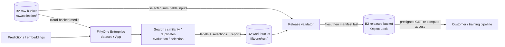

# Curate datasets and publish quality evidence with each release

Evidence reviewed: 2026-09-29. FiftyOne Enterprise documents cloud-backed media, managed cloud credentials, and a MinIO-compatible configuration with a custom `endpoint_url`. This architecture treats that path as a B2 integration candidate and requires the exact addressing and media operations to pass the acceptance checks below.

## Workload

An AI data provider stores source media in B2 and uses FiftyOne to explore the collection, calculate embeddings, find duplicates, evaluate model outputs, inspect failure slices, and select a higher-quality dataset. Selected media references, labels, reports, and provenance are exported to B2, validated, and published as an immutable release.

B2 is the durable media and release system of record. FiftyOne's database, indexes, sessions, embeddings, previews, operators, and compute remain on infrastructure designed for those workloads.

## Data flow



The release should capture the selection view or rule, dataset identity, model and embedding versions, evaluation configuration, input object versions or checksums, exclusions, and output checksums. A saved FiftyOne view alone is not a durable customer release contract.

## B2 zones

| Zone | Suggested location | FiftyOne relationship | Policy |
|---|---|---|---|
| Raw | `<org>-fiftyone-raw/raw/<collection>/` | Read-only cloud-backed media | Version and lifecycle superseded inputs according to collection policy |
| Work | `<org>-fiftyone-work/fiftyone/<run>/` | Exported selections, labels, reports, and provenance | Retain for review; expire superseded runs |
| Releases | `<org>-fiftyone-releases/releases/<dataset>/<version>/` | Downstream delivery, not FiftyOne application state | Immutable version; Object Lock governance by default |
| DR, optional | `<org>-fiftyone-releases-dr/` | No FiftyOne access | Cloud Replication target |

Use a manifest or inventory to bind each FiftyOne sample to a stable B2 object key plus a version or checksum. Avoid making a mutable object URL the only identity for a sample.

## Candidate custom-endpoint connection

FiftyOne Enterprise's installation documentation describes a MinIO credential profile with an `endpoint_url`, access key, secret key, optional alias, and region. The candidate B2 profile follows that documented shape:

```ini
[default]
access_key = <B2 application key ID>
secret_access_key = <B2 application key>
endpoint_url = https://s3.<region>.backblazeb2.com
alias = b2
region = <bucket region>
```

Use secrets management or FiftyOne's managed cloud-credential controls rather than committing this file. Scope the credential to the intended bucket and, where the deployed integration honors it, the narrowest source prefix.

The documented provider path is named for MinIO, not B2. Do not publish a definitive configuration recipe until the deployed FiftyOne version confirms:

- whether samples use endpoint-based HTTPS paths, an alias scheme, or another canonical path;
- whether the App, SDK, delegated operators, and media cache all route the same path through the custom credential;
- whether virtual-hosted or path-style bucket addressing is required;
- whether ranged reads, video seeking, signed browser access, and content types work as expected.

Public buckets are not needed. Do not store expiring presigned URLs as durable sample paths because they will fail after expiry and make dataset state time-dependent.

## Curation and publication

1. Create a stable source inventory containing B2 key, object version when available, size, media type, and checksum.
2. Populate a FiftyOne dataset whose filepaths resolve through the tested B2 cloud-media configuration.
3. Import ground truth, model predictions, and relevant sample metadata.
4. Run embeddings, similarity, uniqueness, duplicate detection, evaluations, and human review on external compute.
5. Save the selection criteria and export selected sample identities, labels, metrics, failure slices, and quality reports to the work zone.
6. Validate that every selected sample resolves to the expected immutable input and that labels and metrics conform to the release schema.
7. Publish files and metadata using the shared [dataset release contract](../../docs/dataset-release-contract.md), with `manifest.json` uploaded last.

The release may copy selected media into its own immutable prefix or reference an immutable, retained source version. Copying simplifies customer delivery and retention reasoning; referencing avoids duplication but requires the source objects to remain available for the release lifetime.

## Credential model

| Role | Scope | Capabilities |
|---|---|---|
| FiftyOne media reader | Raw bucket and collection prefix | `listFiles,readFiles` |
| Curation exporter | Work bucket and run prefix | `listFiles,readFiles,writeFiles` |
| Release validator | Raw selection plus work run | `listFiles,readFiles` |
| Release publisher | Release dataset prefix | `listFiles,readFiles,writeFiles,writeFileRetentions` |
| Delivery signer | Released dataset prefix | `listFiles,readFiles` |

FiftyOne managed credentials can be scoped by provider, bucket, user, or group according to its documentation. Use the smallest audience and bucket set that supports the curation team. Keep the release publisher separate from interactive operators and plugins.

## Performance

Cloud-backed media reduces unnecessary source copies but does not eliminate latency-sensitive reads. Plan for:

- a media or preview cache near the FiftyOne deployment;
- local or compute-adjacent storage for embeddings, indexes, and databases;
- batching and concurrency limits for large scans;
- immutable object identity so cached media cannot silently diverge from the catalog;
- measured image, video, and range-read performance with representative files.

Use Standard B2 by default. Consider compute-local caching for repeated analysis of the same immutable collection; evaluate higher-throughput storage options only after measurement shows object-store throughput is the bottleneck.

## Security and governance

- Use read-only raw credentials and separate output writers.
- Restrict managed cloud credentials to the curation team and required buckets.
- Review plugins and delegated operators before allowing them to access raw or sensitive media.
- Treat thumbnails, embeddings, similarity indexes, predictions, and failure slices as derived personal or confidential data when the source warrants it.
- Record why samples were included or excluded and which model, embedding, and evaluation versions influenced the decision.
- Delete cached and indexed derivatives when contractual deletion applies, while respecting any valid immutable-release retention.

## Keep off B2

Do not place FiftyOne's database, indexes, sessions, compute scratch data, or low-latency cache inside B2 dataset prefixes. Store durable exports and releases in B2; use application-appropriate storage for interactive state.

## Acceptance checks

1. The custom endpoint and credential profile can list and read a prefix-scoped private B2 collection.
2. The App, SDK, and selected delegated operators resolve the same media paths.
3. Images, thumbnails, video range reads, and media metadata work without public access.
4. Credential scoping and rotation behave correctly for users, groups, and services.
5. Cached content is invalidated or keyed by immutable object identity.
6. Curation exports are deterministic enough to reproduce a release from its input inventory and configuration.
7. Representative scans, embeddings, and interactive review meet performance objectives.

## Evidence and validation scope

This architecture is documentation-reviewed. FiftyOne documents custom endpoint configuration for its MinIO-compatible cloud-media path, but its documentation does not name Backblaze B2. The repository therefore records a credible integration path and explicit acceptance contract rather than claiming a completed B2 deployment.

## References

- [FiftyOne Enterprise cloud-backed media](https://docs.voxel51.com/enterprise/cloud_media.html)
- [FiftyOne Enterprise installation and cloud credentials](https://docs.voxel51.com/enterprise/installation.html)
- [FiftyOne environment guidance](https://docs.voxel51.com/environments/index.html)
- [Backblaze B2 S3-compatible API](https://www.backblaze.com/docs/cloud-storage-s3-compatible-api)
- [Dataset release contract](../../docs/dataset-release-contract.md)
