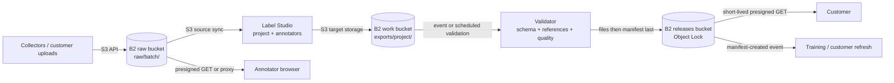

# Annotate multimodal data with separate source and target storage

Evidence reviewed: 2026-09-29. This design is based on Label Studio's source/target storage documentation, its boto3 custom-endpoint implementation, and current Backblaze B2 documentation. Deployment-specific permissions, CORS, and network controls must be tested in the target environment.

## Workload

An AI data provider places images, video, audio, text, or JSON task definitions in Backblaze B2. Label Studio syncs that source storage into an annotation project and writes completed annotations to a target prefix. A validator turns approved exports into immutable, checksummed dataset releases for customer delivery.

B2 stores large durable objects and released datasets. Label Studio's database, queues, application uploads, and compute remain on application-appropriate storage.

## Data flow

Label Studio source storage can either list media objects and construct tasks or read JSON/JSONL task definitions. With presigned URLs enabled, annotator browsers read media directly from B2 and require correct CORS. With presigning disabled, Label Studio proxies media through its workers; that avoids browser-to-B2 CORS but increases application bandwidth and worker load.

## B2 zones

| Zone | Suggested bucket and prefix | Label Studio relationship | Lifecycle |
|---|---|---|---|
| Raw | `<org>-ls-raw/raw/<batch>/` | S3 source storage | Keep current objects; expire superseded versions according to collection policy |
| Work | `<org>-ls-work/exports/<project>/` | S3 target storage | Retain long enough for review and release; expire superseded work |
| Releases | `<org>-ls-releases/releases/<dataset>/<version>/` | Read by delivery and downstream consumers, not edited by Label Studio | Immutable version; Object Lock governance by default |
| DR, optional | `<org>-ls-releases-dr/` | No direct Label Studio access | Cloud Replication target with compatible lock posture |

Separate buckets are preferred because Object Lock, lifecycle, replication, encryption and notifications are bucket-level concerns. A proof of concept may use separate prefixes in one bucket, but it does not model all production controls.

## Connect Label Studio to B2

Label Studio documents Amazon S3 source and target storage with an optional **S3 Endpoint**. Use the B2 endpoint for the bucket's region:

`https://s3.<region>.backblazeb2.com`

Do not copy a region from an example. Derive it from the B2 bucket and set the corresponding region in Label Studio.

### Source connection

| Label Studio field | B2 value |
|---|---|
| Storage type | Amazon S3 source storage |
| Bucket | Raw bucket |
| Bucket prefix | `raw/` or a project-specific child prefix |
| S3 Endpoint | B2 S3 endpoint derived from the bucket region |
| Access Key ID | B2 application key ID |
| Secret Access Key | B2 application key |
| Use presigned URLs | On for direct browser delivery; off to proxy through Label Studio |

Use a B2 application key scoped to the raw bucket and prefix with `listFiles,readFiles`. Label Studio's documented “Files” import mode needs listing; task-definition imports also need object reads.

### Target connection

Use a separate key scoped to the work bucket's `exports/` prefix with `listFiles,readFiles,writeFiles`. Do not grant `deleteFiles` unless operators explicitly enable synchronized deletion and the retention policy permits it.

Label Studio's [S3 storage guide](https://labelstud.io/guide/storage_s3) is authoritative for its current UI and API fields. Its [general storage guide](https://labelstud.io/guide/storage) explains source sync, task import, presigned URLs, proxy mode and browser access.

## CORS and browser delivery

When presigned URLs are enabled, configure the raw bucket to allow the Label Studio origin to issue browser `GET` and `HEAD` requests. Prefer the exact HTTPS origin over `*`. Proxy mode does not require browser-to-B2 CORS, but all media bytes pass through Label Studio.

These are distinct controls:

- The source application key lets the Label Studio backend list objects and sign or proxy reads.
- CORS lets an annotator's browser use a presigned B2 URL from the Label Studio origin.
- Label Studio project permissions decide which users may reach each task.

## Publish and deliver a release

1. Review and approve annotations in Label Studio.
2. Sync or export annotations to `exports/<project>/`.
3. Validate task structure, media references, label taxonomy, coverage, duplicates and checksums.
4. Copy approved media and annotations to `releases/<dataset>/<version>/`.
5. Create the dataset card and Croissant metadata.
6. Apply retention and upload `manifest.json` last.
7. Generate customer delivery manifests on demand from a read-only, prefix-scoped signing key.

Use the shared [dataset release contract](../../docs/dataset-release-contract.md) and [release manifest schema](../../schemas/release-manifest.schema.json).

## Security and governance

- Keep source and target credentials separate. Compromise of a target writer must not permit reads across all raw collections.
- Restrict access to Label Studio storage configuration because a custom endpoint causes server-side network requests.
- Treat delivery URLs as bearer credentials and keep their TTL short.
- Keep administrative bucket, lifecycle, Object Lock and replication credentials out of Label Studio.
- Put collection rights, consent basis, sensitive-data classifications, annotation provenance and permitted uses in the dataset card and machine-readable metadata.
- Match work-bucket lifecycle and release retention to deletion obligations. Object Lock can prevent deletion for the selected period.

## Boundaries

Do not use B2 dataset buckets for Label Studio's relational database, queues, low-latency cache, or container filesystem. Do not treat Cloud Replication as customer delivery. B2 supplies durable objects; Label Studio and the validator supply annotation state, workflow, quality gates and compute.

## Evidence and validation scope

- Label Studio documentation describes source and target Amazon S3 storage, custom S3 endpoints, presigned URLs, proxy delivery, CORS, and API-driven sync.
- Label Studio source constructs boto3 S3 clients and resources with the configured `endpoint_url` and SigV4.
- B2 application-key capabilities and bucket controls are mapped from the S3 operations used by the integration.
- The target deployment must confirm its exact Label Studio edition/version, bucket region, CORS origin, import mode, endpoint reachability and least-privilege capabilities.

## References

- [Label Studio: set up Amazon S3 cloud storage](https://labelstud.io/guide/storage_s3)
- [Label Studio: sync data from external storage](https://labelstud.io/guide/storage)
- [Backblaze B2 documentation](https://www.backblaze.com/docs/cloud-storage)
- [Backblaze S3-compatible API](https://www.backblaze.com/docs/cloud-storage-s3-compatible-api)
