# Import to a training platform via presigned URLs and return approved exports

Evidence reviewed: 2026-09-29. Roboflow documents one-time or scripted ingestion from S3 through presigned URLs and its upload API. This architecture uses the same bounded transfer pattern with B2-generated S3 presigned URLs. It does not claim that Roboflow's persistent AWS Datasource or Bucket Mirror accepts a Backblaze custom endpoint.

## Workload

An AI data provider keeps private computer-vision source assets in B2, selects a bounded import batch, and submits short-lived read URLs to Roboflow. Roboflow retrieves and copies those assets for annotation, preprocessing, augmentation, versioning, or training. Approved, model-independent dataset exports return to B2 for validation, immutable publication, and customer delivery.

This is a processor handoff across a trust boundary, not remote object browsing. B2 remains the source and release system of record; Roboflow becomes an additional data location for imported objects and generated derivatives.

## Data flow

```mermaid
flowchart LR
  RAW[(Private B2 raw bucket<br/>raw/batch/)] -->|inventory| ADAPTER[Import adapter]
  ADAPTER -->|short-lived presigned GET URLs| RFAPI[Roboflow upload API]
  RFAPI --> RF[Roboflow project<br/>annotate / transform / version]
  RF -->|supported export| WORK[(B2 work bucket<br/>roboflow/project/)]
  WORK -->|schema + provenance + checksum validation| VAL[Release validator]
  VAL -->|files, then manifest last| REL[(B2 releases bucket<br/>Object Lock)]
  REL -->|short-lived presigned GET| CUSTOMER[Customer / training consumer]
```

The import adapter should be small and auditable. It lists only an approved prefix, generates URLs, submits them to Roboflow, waits for each result, and records the mapping from immutable B2 input identity to the Roboflow asset identity.

## Why presigned import

Roboflow's current AWS S3 guide distinguishes two paths:

- persistent Datasources and Bucket Mirror for AWS S3; and
- signed URLs or local download for one-time and scripted imports.

Because the persistent credential documentation is AWS-specific, use the documented signed-URL API path for B2. A B2 S3 client can generate a SigV4 presigned `GET` URL when configured with the bucket's regional endpoint. The Roboflow service receives only temporary object access, not a reusable B2 application key.

## B2 zones

| Zone | Suggested location | Roboflow relationship | Policy |
|---|---|---|---|
| Raw | `<org>-roboflow-raw/raw/<batch>/` | Source of presigned import URLs | Private; versioned; read-only signer |
| Work | `<org>-roboflow-work/roboflow/<project>/<export>/` | Destination for returned exports and reports | Retain through validation; expire superseded work |
| Releases | `<org>-roboflow-releases/releases/<dataset>/<version>/` | Customer-ready output | Immutable version; Object Lock governance by default |
| DR, optional | `<org>-roboflow-releases-dr/` | No Roboflow access | Cloud Replication target |

## Import contract

Freeze an import inventory before issuing URLs. At minimum, record:

| Field | Purpose |
|---|---|
| Batch and item ID | Stable workflow identity |
| B2 bucket and object key | Source location without credentials |
| B2 object version, when available | Immutable source identity |
| SHA-256 and size | Integrity and retry deduplication |
| Media type and split | Roboflow project placement |
| Presigned URL expiry time | Operational troubleshooting; do not persist the URL itself |
| Roboflow project and returned asset ID | Cross-system provenance |
| Import status and attempts | Idempotent retry control |

The adapter must configure its S3 client with `https://s3.<region>.backblazeb2.com`; Roboflow's AWS-oriented sample omits a custom endpoint because it targets AWS. Generate one URL per approved object and submit it before its expiry.

Choose a TTL that covers queueing and retrieval with a small margin, not the entire annotation project. If a URL expires before Roboflow fetches it, generate a new URL for the same immutable object and update the attempt record. Never make the source bucket public to avoid handling retries.

## Credential and secret model

| Role | Scope | Capabilities |
|---|---|---|
| Import signer | Raw bucket and approved batch prefix | `listFiles,readFiles` |
| Export receiver | Work bucket and project prefix | `listFiles,readFiles,writeFiles` |
| Release validator | Work export prefix | `listFiles,readFiles` |
| Release publisher | Release dataset prefix | `listFiles,readFiles,writeFiles,writeFileRetentions` |
| Delivery signer | Released dataset prefix | `listFiles,readFiles` |

Store the Roboflow API key in a secret manager. Roboflow's example API places its API key in the request URL, so scrub query strings from application, proxy, and error logs. Do not write API keys, B2 keys, or live presigned URLs to the import inventory, B2 metadata, release manifest, or source control.

## Export and release

1. Complete annotation, preprocessing, augmentation, and review in Roboflow.
2. Freeze the Roboflow dataset version and export configuration.
3. Use a supported Roboflow export route to retrieve model-independent dataset artifacts.
4. Upload those artifacts to the B2 work prefix with checksums and the original import mapping.
5. Validate format, class taxonomy, splits, item counts, annotation bounds, transformations, licensing, and source-to-export provenance.
6. Publish a new immutable B2 release using the shared [dataset release contract](../../docs/dataset-release-contract.md).
7. Upload `manifest.json` last and generate customer delivery manifests on demand.

Do not treat a Roboflow-hosted project or generated training URL as the durable customer release. The B2 release should be independently verifiable and usable without access to the Roboflow workspace.

## Security, privacy, and governance

- Treat Roboflow as a separate processor and data location because it retrieves a copy of every imported object.
- Confirm allowed data types, regions, subprocessors, retention, deletion, and model-training terms before transfer.
- Minimize each import batch and grant temporary object access only to that batch.
- Preserve source checksums, returned asset identities, transformation settings, reviewer history, and export checksums.
- Reconcile deletion across raw B2 objects, Roboflow assets and versions, local adapter state, work exports, and released versions subject to retention.
- Never send regulated or customer-restricted data until the applicable processor agreement and workspace controls are in place.

## Scale and reliability

Presigned imports are well suited to bounded or scripted transfers. For large batches:

- paginate B2 listings and freeze the result before submission;
- limit concurrent API submissions and honor provider rate limits;
- make retries idempotent using source checksum plus project identity;
- distinguish URL expiry from permanent validation or policy failures;
- checkpoint returned asset IDs frequently;
- measure total copy time and account for data moving into and out of the provider.

If continuous mirroring is required, run a separate product and security evaluation. Do not silently substitute Roboflow's AWS-specific Datasource configuration and label it B2-compatible.

## Acceptance checks

1. Roboflow can fetch a private B2 object through a short-lived SigV4 presigned GET URL.
2. Content type, file name, size, and image decoding survive the transfer.
3. The adapter handles URL expiry, API throttling, duplicate requests, partial batches, and restart recovery.
4. No logs or inventories retain Roboflow API keys or live presigned URLs.
5. The export route returns all expected images, labels, splits, and transformation metadata.
6. A release can be independently validated and consumed from B2 without Roboflow access.
7. Deletion and retention operations can be reconciled across both systems.

## Evidence and validation scope

This architecture is documentation-reviewed. Roboflow explicitly documents signed-URL ingestion for one-time or scripted S3 imports. The repository's S3 application tests cover the general B2-compatible presigning pattern, but they do not call the Roboflow service. Production acceptance must exercise an actual Roboflow workspace with non-sensitive test media.

## References

- [Roboflow: upload images from an AWS S3 bucket](https://docs.roboflow.com/datasets/create-and-upload/adding-data/upload-data-from-aws-gcp-and-azure/aws-s3-bucket)
- [Roboflow upload API reference](https://docs.roboflow.com/reference/upload-api)
- [Backblaze B2 pre-signed URLs](https://www.backblaze.com/docs/cloud-storage-use-pre-signed-urls-with-the-s3-compatible-api)
- [Dataset release contract](../../docs/dataset-release-contract.md)
