# Supervisely annotation and dataset pipeline on Backblaze B2

Evidence reviewed: 2026-09-29. Supervisely documents support for any S3-compatible remote storage, configurable endpoints, cloud imports, remote links, and S3-compatible exports. This design maps those documented controls to B2; deployment-specific addressing, credentials, media loading, and write behavior still require acceptance testing.

## Workload

An AI data provider stores large image and video collections in B2, uses Supervisely for annotation, review, transformation, and application workflows, then returns approved exports and quality evidence to B2. A separate publisher creates immutable customer releases.

B2 stores raw media, durable exports, and released datasets. Supervisely retains its application database, queues, caches, previews, and compute state on platform-appropriate storage.

## Choose the Supervisely storage mode

Supervisely exposes several distinct storage paths. Select one deliberately:

| Mode | Use | Data movement |
|---|---|---|
| Instance-wide remote storage | Store Supervisely-managed files in an S3-compatible backend | Supervisely writes its managed objects to remote storage |
| Team cloud storage import | Let a team import from its own connected storage | May copy or link according to the selected import flow |
| Links plugin / remote links | Reference objects already present in cloud storage | Source media remains remote; Supervisely stores references and derivatives |
| Cloud export | Send an approved project or dataset to connected S3-compatible storage | Creates export objects in the chosen destination |

Do not configure instance-wide remote storage when the requirement is merely to reference an existing source bucket. Supervisely's documentation explicitly directs existing-file workflows to the cloud import or Links paths.

## Data flow

```mermaid
flowchart LR
  SRC[Collectors / customer uploads] -->|S3 API| RAW[(B2 raw bucket<br/>raw/batch/)]
  RAW -->|team cloud import or remote links| SLY[Supervisely<br/>projects + apps + reviewers]
  SLY -->|S3-compatible export| WORK[(B2 work bucket<br/>supervisely/project/)]
  WORK -->|validate| VAL[Release validator<br/>schema + quality + checksums]
  VAL -->|files, then manifest last| REL[(B2 releases bucket<br/>Object Lock)]
  REL -->|short-lived presigned GET| CUSTOMER[Customer / downstream training]
```

If Supervisely itself uses B2 as instance-wide remote storage, its managed public/private bucket layout is separate from the raw/work/release zones above. Both documented Supervisely buckets remain private despite their generated names.

## B2 zones

| Zone | Suggested location | Supervisely relationship | Policy |
|---|---|---|---|
| Raw | `<org>-supervisely-raw/raw/<batch>/` | Team cloud import or linked media source | Source-reader access; version and expire superseded inputs under policy |
| Work | `<org>-supervisely-work/supervisely/<project>/` | Export destination and quality reports | Writer access; retain for review and release |
| Releases | `<org>-supervisely-releases/releases/<dataset>/<version>/` | No direct Supervisely write access | Immutable versions; Object Lock governance by default |
| DR, optional | `<org>-supervisely-releases-dr/` | No Supervisely access | Cloud Replication target |

## Configure S3-compatible storage

For instance-wide S3-compatible remote storage, Supervisely documents the `minio` provider with an endpoint, port, access key, and secret key. The B2 mapping is:

| Supervisely setting | B2 value |
|---|---|
| `STORAGE_PROVIDER` | `minio` for the documented S3-compatible path |
| `STORAGE_ENDPOINT` | `s3.<region>.backblazeb2.com` derived from the bucket region |
| `STORAGE_PORT` | `443` |
| `STORAGE_ACCESS_KEY` | B2 application key ID |
| `STORAGE_SECRET_KEY` | B2 application key |

Use the corresponding endpoint field when configuring team cloud storage or a remote-link provider. Confirm the exact field format in the deployed Supervisely release; instance environment variables may expect a hostname while UI or YAML fields may expect a full URL.

For files larger than 4 GB, Supervisely calls out multipart permissions in its S3 guidance. Exercise large upload initiation, part upload, completion, abort, and retry behavior against B2 during acceptance testing.

## Existing B2 media

For an existing private B2 collection:

1. Create a source-reader key restricted to the raw bucket and selected prefix.
2. Configure the team cloud provider or remote-links configuration with the B2 endpoint and credentials.
3. Import a small inventory and verify whether the selected flow links or copies each asset.
4. Confirm browser and server media access, thumbnails, video seeking, and cache behavior.
5. Record stable B2 keys and checksums as provenance; do not store expiring presigned URLs as permanent asset identifiers.

Public URLs are not required. Prefer private objects and server-side credentials, or use short-lived URLs only for bounded transfers that Supervisely completes before expiry.

## Credential model

| Role | Scope | Capabilities |
|---|---|---|
| Supervisely source reader | Raw bucket and `raw/<batch>/` | `listFiles,readFiles` |
| Supervisely export writer | Work bucket and `supervisely/<project>/` | `listFiles,readFiles,writeFiles` |
| Release validator | Work prefix | `listFiles,readFiles` |
| Release publisher | Releases bucket and dataset prefix | `listFiles,readFiles,writeFiles,writeFileRetentions` |
| Delivery signer | Released dataset prefix | `listFiles,readFiles` |

Instance-wide remote storage may need broader permissions over the buckets Supervisely manages. Do not reuse that credential for raw customer collections or release publication.

## Publish a release

1. Freeze the source inventory and Supervisely project identity.
2. Complete annotation, review, transformation, or application workflows.
3. Export approved data and reports to the B2 work zone.
4. Validate media references, annotation structure, class taxonomy, counts, quality thresholds, and checksums.
5. Record the project, application/model versions, import mode, reviewer decisions, and source checksums.
6. Publish using the shared [dataset release contract](../../docs/dataset-release-contract.md), writing `manifest.json` last.
7. Generate expiring customer delivery manifests on demand.

## Security and governance

- Limit remote-storage configuration to trusted administrators because it controls server-side network and credential use.
- Separate linked-source readers, export writers, release publishers, and delivery signers.
- Treat copied imports, previews, cached video, thumbnails, model outputs, and annotations as additional governed copies.
- Keep keys out of link files, project archives, application parameters, and logs.
- Align project deletion, cache expiry, B2 lifecycle, and release retention with customer deletion and contractual obligations.
- Use governance-mode Object Lock by default for released versions; use compliance mode only for an explicit requirement.

## Keep off B2

Keep Supervisely's database, queues, application state, container volumes, and low-latency caches off dataset buckets. B2 is appropriate for durable media, exported artifacts, and immutable releases, not transactional state or compute scratch storage.

## Acceptance checks

Test the chosen mode on the exact Supervisely release:

1. Endpoint parsing, TLS, SigV4 signing, region, and bucket addressing work with B2.
2. Prefix-scoped listing and object reads work for private source media.
3. Remote links do not unexpectedly copy full source objects.
4. Import, thumbnail generation, image display, video seeking, and application reads meet latency requirements.
5. S3-compatible export writes only to the intended work prefix and supports representative large files.
6. Credential rotation and failed multipart cleanup behave safely.
7. Deleting a project does not remove governed B2 source objects unless that behavior is explicitly intended and tested.

## Evidence and validation scope

This architecture is documentation-reviewed. Supervisely explicitly documents arbitrary S3-compatible storage and configurable endpoints. Production readiness depends on validating the selected Supervisely mode and release against a B2 test bucket with representative media.

## References

- [Supervisely remote storage](https://docs.supervisely.com/enterprise-edition/advanced-tuning/s3)
- [Supervisely import from cloud](https://docs.supervisely.com/import-and-export/import/import-from-cloud)
- [Supervisely export](https://docs.supervisely.com/import-and-export/export)
- [Backblaze B2 S3-compatible API](https://www.backblaze.com/docs/cloud-storage-s3-compatible-api)
- [Dataset release contract](../../docs/dataset-release-contract.md)
